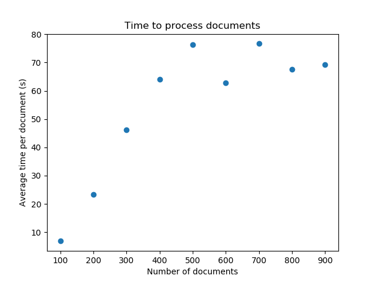

# Spacy load balencer

This is a utility project meant to make it easy to launch a set of [SpaCy](https://spacy.io/) docker containers from 
the [SpaCy REST API](https://github.com/jgontrum/spacy-api-docker) project.
As the current (version 2) goal for SpaCy is to optimize the single-core efficiency, this project is meant to leverage multi-core machines.

**NOTE:** the code was written for windows systems (i.e. I wrote `.bat` utility scripts instead of `.sh` ones)

* The Docker config is based on the code found [here](https://docs.docker.com/get-started/part3/).
* The request code is based on the code found [here](https://stackoverflow.com/questions/51699817/python-async-post-requests)

## Results

Using the current configuration and execution code, the following results were obtained

  

## Usage notes
When using `process_documents()`, if you intend on calling the function multiple times you have to provide the event loop.
This is because the `asincio` library does some weird stuff if you call `loop.close()`, then initialize another one later.
You can do this by initializing a loop using `asyncio.get_event_loop()`, then passing it to the function through the 
optional parameter `job_loop`. **NOTE** that this also means you have to close the loop yourself after finishing.
An example of this can be seen in the [execution file](manager/execute.py).